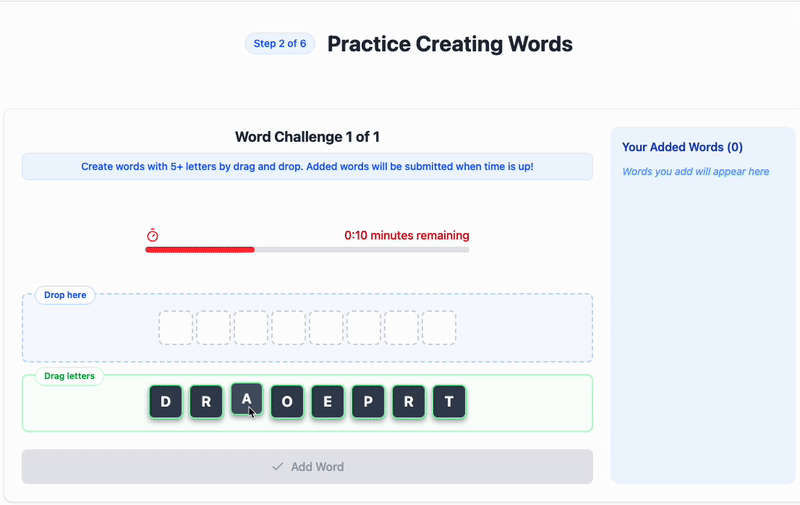

# Play a Word Puzzle Game

https://puzzle-solving-game-study.vercel.app/

## Frontend React.js Application

This directory contains the React.js frontend for the anagram game study application, designed to investigate the effects of different intervention messages on user behavior while solving word puzzles.

### A Scene from the Game



### Prerequisites

- Node.js 18+ and npm
- Modern web browser
- Backend API running (see backend directory README)

### Setup and Running

#### Installation

1. Install dependencies:

   ```bash
   npm install
   ```

2. Create a `.env` file in the root of this directory:

   ```bash
   # This code is used by the survey completion component
   VITE_SURVEY_COMPLETION_CODE=your_survey_code
   VITE_SURVEY_LINK=your_survey_link
   ```

3. Start the development server:
   ```bash
   npm run dev
   ```
   The frontend will be available at http://localhost:5173 (normally if the port is not in use).

### Building for Production

To build the application for production:

```bash
npm run build
```

### Application Flow

The application guides users through a sequence of steps:

```
App.jsx (Entry point)
├── LandingPage
│       ├── RewardDisplay (Shows potential earnings structure)
│       └── CoinIcon (Visual representation of rewards)
├── ProlificIdPage (Collects participant ID)
├── TutorialGame (Practice round)
│       ├── GameBoard (Main game interface)
│       └── GameTimer (Countdown timer)
├── TestPage (Main game phase)
│   └── AnagramGame
│       ├── MessageDisplay (Shows anti-cheating intervention message)
│       ├── GameBoard (Main game interface)
│       └── GameTimer (Countdown timer)
├── SurveyPage (Post-game questionnaire)
├── WordMeaningCheck (Word validation phase)
├── DebriefPage (Study explanation)
└── ThankYouPage (Completion page)
```

### Component Overview

#### Main Pages

1. **App.jsx**: Manages overall application state and navigation flow between phases.

2. **LandingPage**: Introduces the study with:

   - Explanation of game mechanics and rewards
   - Privacy details and consent collection
   - Device compatibility warnings

3. **ProlificIdPage**: Securely collects the participant's Prolific ID for:

   - Session initialization with the backend
   - Tracking game progress across components
   - Eventual reward distribution

4. **TutorialGame**: Provides a practice environment where participants:

   - Learn drag-and-drop letter arrangement
   - Understand word validation process
   - See time limit functionality in action
   - Experience the reward system

5. **TestPage**: Central experiment component where users:

   - Receive intervention messages based on psychological theories
   - Solve multiple anagram puzzles
   - Earn rewards based on word length and validity
   - Have their behaviors monitored for research purposes

6. **SurveyPage**: Collects feedback about:

   - Game experience
   - Reaction to intervention messages
   - Self-reported behavior during gameplay

7. **WordMeaningCheck**: Asks participants to provide meanings for created words to:

   - Assess understanding of submitted words
   - Gather data for potential cheating detection
   - Evaluate word formation strategy

8. **DebriefPage**: Explains:

   - Study goals and methods
   - How data will be used
   - Total rewards earned
   - Option to report external resource usage

9. **ThankYouPage**: Finalizes the participant experience with:
   - Confirmation of completion
   - Instructions for returning to Prolific
   - Researcher contact information

#### Game-Specific Components

- **GameBoard.jsx**: Core game interface with:

  - Drag-and-drop letter arrangement
  - Word submission system
  - Validated word display
  - Progress tracking

- **GameTimer.jsx**: Visual countdown timer that:

  - Shows remaining time
  - Changes color when time is running low
  - Triggers automatic submission when time expires

- **MessageDisplay.jsx**: Presents intervention messages with:

  - Typewriter animation effect for better engagement
  - Minimum reading time enforcement
  - Theory-based styling
  - Message display timing tracking

- **EventTrack.jsx**: Invisible component that monitors:
  - Page visibility changes (tab switching)
  - Mouse activity and inactivity periods
  - Focus/blur events
  - Timestamps for all tracked behaviors

### Game Mechanics

The anagram game challenges participants to create valid English words from scrambled letters:

1. **Letter Arrangement**: Drag and drop letters from the available pool to the solution area
2. **Word Validation**: Words must be 5+ letters and valid English words
3. **Rewards**: Longer words earn more rewards (e.g., 8-letter words earn 15 pence)
4. **Time Limit**: Each anagram has a fixed time limit (typically 3 minutes)
5. **Multiple Anagrams**: Participants solve 2 separate anagrams during the main game

### Behavior Tracking System

The application includes comprehensive event tracking to monitor participant behaviors:

- **Page visibility changes**: Detects when users switch tabs, minimize the window, or use Alt+Tab
- **Mouse activity monitoring**: Tracks periods of mouse inactivity (5+ seconds)
- **Focus/blur events**: Records when the application loses or gains focus
- **Response times**: Measures time spent on each anagram and word
- **Submission patterns**: Analyzes patterns in word submissions that might indicate external help

This tracking is implemented through the `EventTrack.jsx` component, which captures these behaviors and sends them to the backend for analysis.

### Anti-Cheating System

The application implements a sophisticated intervention system:

1. **Message Display**: Shows theory-based messages designed to encourage honest gameplay
2. **Message Tracking**: Records time spent reading intervention messages
3. **Behavior Monitoring**: Tracks patterns that might indicate external resource use
4. **Word Meaning Check**: Asks participants to explain their submitted words
5. **Confession Opportunity**: Provides a non-judgmental chance to report external help usage

### Configuration

The application's API connection is configured in `vite.config.js`:

```javascript
export default defineConfig(({ mode }) => {
  // Determine API URL based on mode
  const apiUrl =
    mode === "production"
      ? "https://puzzle-solving-game-study.onrender.com"
      : "http://localhost:8000";

  return {
    plugins: [react(), tailwindcss()],
    // Define environment variables that will be statically replaced at build time
    define: {
      "import.meta.env.VITE_API_URL": JSON.stringify(apiUrl),
    },
    server: {
      proxy: {
        "/api": {
          target: apiUrl,
          changeOrigin: true,
        },
      },
    },
  };
});
```

This configuration automatically selects the appropriate backend URL based on whether you're in development or production mode, eliminating the need to specify the API URL in the `.env` file.
