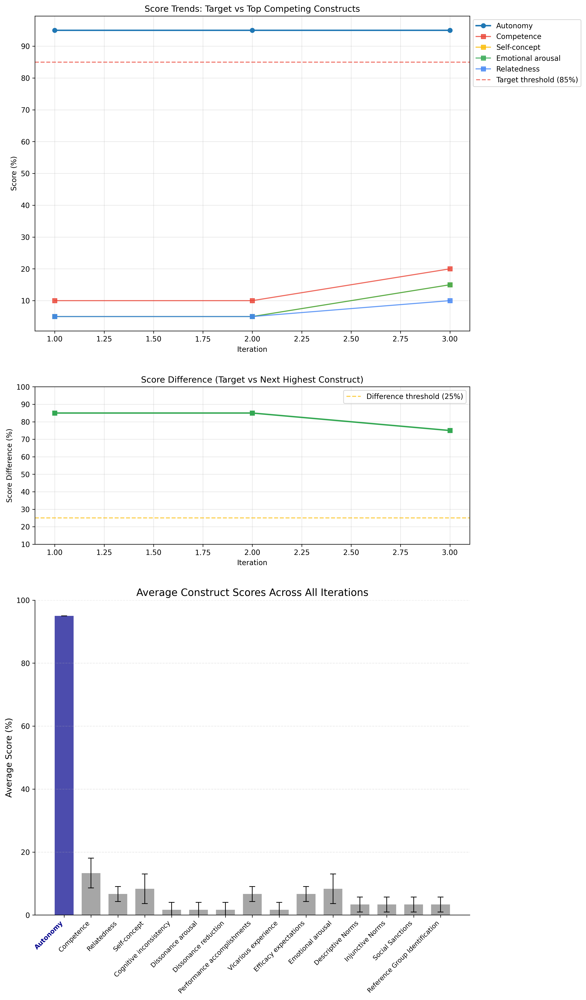
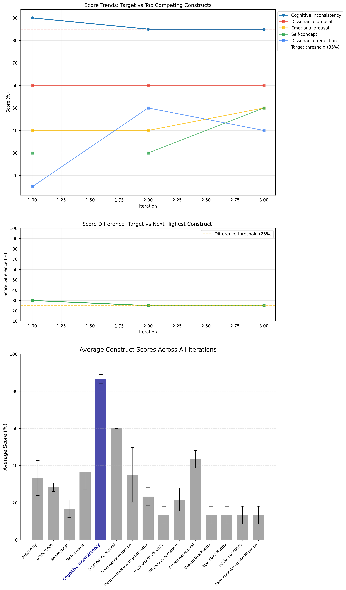
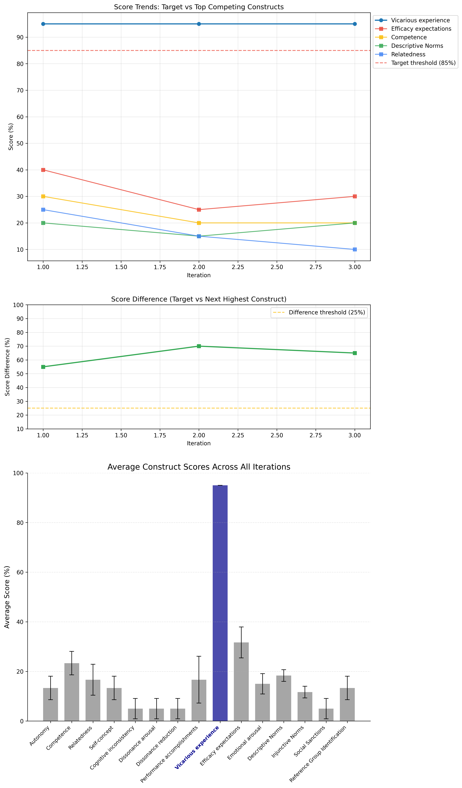

# Message Intervention Framework

This framework optimizes motivational messages for honest puzzle-solving in games, using a sophisticated agent-based approach to generate messages aligned with various psychological constructs.

## Overview

The Message Intervention Framework is a critical component of the larger game-behavior-intervention-study. It serves to generate, evaluate, and optimize psychologically-aligned messages that aim to reduce cheating behavior in the puzzle solving game while encouraging better performance. The system leverages advanced language models in a carefully designed workflow to create effective behavioral interventions.

## Getting Started

### Environment Setup

1. Create a new Python virtual environment:

```bash
# Using conda
conda create -n <env_name e.g. game_intervention_behavior>
```

2. Activate the environment:

```bash
# Using conda (all platforms)
conda activate game_intervention_behavior
```

3. Install dependencies:

```bash
pip install -r requirements.txt
```

### API Configuration

Create a `.env` file in the root directory (/message-intervention-framework) with your API keys:

```
TOGETHER_API_KEY=your_together_ai_key_here
OPENAI_API_KEY=your_openai_key_here
```

These keys are essential for connecting to the respective APIs:

- `TOGETHER_API_KEY`: For accessing Llama 3.3 70B via Together.ai
- `OPENAI_API_KEY`: For accessing GPT-4o via OpenAI

## Application Flow

The framework follows a three-part architecture centered around message optimization:

```
run_optimizer.py (Entry point)
├── optimizer/message_optimizer.py (Coordinates the optimization process)
│   ├── generator/message_generator.py (Generates messages using LlamaGenerator)
│   │   └── common/constants.py (Provides construct definitions and game context)
│   │
│   ├── evaluator/message_evaluator.py (Evaluates messages using GPTEvaluator)
│   │   ├── common/constants.py (Provides construct definitions)
│   │   └── common/utils.py (Provides utility functions for extracting ratings)
│   │
│   └── common/utils.py (Provides visualization and summary functions)
│
└── common/constants.py (Directly accessed for construct information)
```

## Generator-Evaluator Workflow

The framework implements an iterative optimization process using two specialized agents:

1. **Generator Agent (Llama 3.3 70B)**:

   - Crafts initial messages aligned with specific psychological constructs
   - Refines messages based on feedback from the evaluator

2. **Evaluator Agent (GPT-4o)**:

   - Assesses message alignment with the target construct
   - Provides detailed feedback for improvement
   - Quantifies alignment across all constructs to measure differentiation

3. **Optimizer Component**:
   - Coordinates the interaction between generator and evaluator
   - Implements convergence criteria to determine when a message is sufficiently optimized
   - Tracks performance metrics and saves results

The workflow iteratively improves messages until they reach target thresholds for below conditions for at least 3 iterations consecutively:

- Alignment with the target construct (more than 85%)
- Differentiation from competing constructs (more than 25%)

### Workflow Visualization

Here is the visualization of this workflow:


### Prompt and Feedback Details

The diagram illustrates the high-level workflow, but the actual process involves sophisticated prompting and feedback mechanisms. Here are the key components with specific code implementations:

#### Example Context and Construct Definition

Every prompt includes the game context and construct definition. Here's an example from `common/constants.py`:

```python
# From constants.py
game_context = """
People are playing an anagram game where they can get higher rewards when they create more valid English words
from scrambled words given to them and also when they create words of higher word lengths.
Some players might look up answers online, while others solve the puzzles independently.
"""

all_constructs = {
    "Autonomy": {
        "theory": "Self-Determination Theory (SDT)",
        "description": "Autonomy refers to the intrinsic motivation arising from an individual's experience of volition and self-regulation, with a sense of ownership over their choices and actions. It emphasizes acting according to personal values without external pressure.",
        "examples": [
            "You're free to choose your puzzle-solving strategy – we trust you to find what works best for you.",
            "Your goal is to create words that spark joy and challenge you; no one else's expectations or standards are applied here, just yours.",
            "We don't dictate how you solve the anagrams – every decision about word length, strategy, and more is entirely up to you."
        ],
        "differentiation": {
            "from_Competence": "Unlike Competence (skill development), Autonomy focuses on freedom of choice regardless of skill level.",
            "from_Relatedness": "Unlike Relatedness (social connections), Autonomy focuses on individual independence without reference to others.",
            # [Additional differentiation entries...]
        }
    },
    # [Other constructs...]
}
```

#### Generator Prompts

The message generation process uses a structured prompt template in `generator/message_generator.py`:

```python
# From message_generator.py
def generate_message(self, construct_name, context=None, generation_instruction=None,
                     construct_description=None, construct_examples=None,
                     construct_differentiation=None):
    # [...]

    # Default generation prompt template
    self.default_generation_prompt = """
    Context: {context}

    I need you to craft a message that strongly aligns with the psychological construct of {construct_name}.

    Here is the detailed description of {construct_name}:
    {construct_description}

    Here are examples of messages that exemplify {construct_name}:
    {construct_examples}

    This construct is differentiated from other constructs in these ways:
    {construct_differentiation}

    {generation_instruction}

    Create exactly one message that is 2-3 sentences long, using simple, natural language at approximately an 8th-grade reading level. Avoid complex vocabulary, jargon, or academic phrasing. The message should be easily understood by the average person while still conveying the core principles of {construct_name}.
    """
```

The generator also includes special handling for certain constructs that require additional differentiation:

```python
# From message_generator.py
# Special generator for CDT constructs with enhanced differentiation
if construct_name == "Cognitive inconsistency":
    additional_instruction = "Focus ONLY on recognition of contradictions WITHOUT emotional reactions or resolution attempts."
    generation_instruction += additional_instruction
elif construct_name == "Dissonance arousal":
    additional_instruction = "Focus ONLY on emotional discomfort WITHOUT mentioning recognition or resolution."
    generation_instruction += additional_instruction
```

#### Evaluator Analysis

The evaluator uses a comprehensive prompt template in `evaluator/message_evaluator.py` that includes specific scoring criteria:

```python
# From message_evaluator.py
def _create_augmented_evaluation_prompt(self, context, message, construct_name,
                    construct_description, examples_text, construct_differentiation):
    """Create an augmented evaluation prompt with consistent scoring guidelines."""
    return ChatPromptTemplate.from_messages([
        ("user", """
            Context: {context}

            Message to evaluate: "{message}"

            Target Construct: {construct_name}

            Construct Description: {construct_description}

            Construct Examples: {examples}

            Construct Differentiation: {differentiation}

            SCORING GUIDELINES:
            - Be consistent in your scoring approach
            - When scoring this message, consider it in isolation without comparing to previous iterations
            - For each criterion, provide a specific score explanation with evidence from the message
            - Maintain the same standards across all evaluations
            - Focus on textual evidence rather than inferences

            IMPORTANT EVALUATION GUIDELINES:
            - Maintain consistency in your evaluation approach across messages
            - When a message aligns strongly with the target construct, ensure competing constructs receive proportionally lower scores
            - Be disciplined about score differences - they should reflect meaningful distinctions between constructs
            - Avoid score inflation for non-target constructs that only tangentially relate to the message

            Evaluate how well this message aligns with the target construct using these five criteria:

            1. Core Element Alignment: Does the message capture the essential psychological mechanism of the construct?
            2. Differentiation: Does the message avoid elements explicitly differentiated from this construct?
            3. Language Appropriateness: Does the message use natural, motivational language suitable for an anagram game?
            4. Conciseness: Is the message 2-3 sentences and focused?
            5. Context Relevance: Is the message well-tailored to the anagram game context?

            First, provide a detailed score (0-100%) for the target construct with specific reasoning.

            Then, score ALL the listed psychological constructs:
            {construct_list}

            Use the rubric for scoring as stated below.
            SCORING RUBRIC:
            - 90-100%: Message captures all key aspects of the construct description with appropriate emphasis while clearly avoiding elements of differentiated constructs. Message uses language that precisely captures the psychological mechanism and closely resembles the provided examples.
            - 80-89%: Message clearly invokes most of the key aspects of the construct description and largely avoids differentiated elements. Message contains similar themes to the examples with only minimal overlap with related constructs.
            - 70-79%: Message conveys some important aspects of the construct description but may include elements from one or two differentiated constructs. Message shows general similarity to examples but lacks precision.
            - 50-69%: Message only tangentially relates to the construct description and fails to maintain boundaries from differentiated constructs. Message has limited similarity to examples.
            - 0-49%: Message contradicts the construct description or primarily exemplifies differentiated constructs. Message bears little resemblance to provided examples.

            Present your scores in this format:
            ### Construct Confidence Scores
            - Construct1: XX%
            - Construct2: XX%
            [all constructs]

            Then provide structured feedback in this JSON format:
            {{
                "context": "Specific context improvement",
                "generation_instruction": "Specific guidance for improvement",
                "top_competing_construct": "Name of the most similar competing construct",
                "differentiation_tip": "Specific tip to better differentiate from the top competing construct"
            }}
            """)
    ])
```

#### Example Feedback from Evaluator

Here is an actual example of feedback generated by the GPT-4o evaluator during the optimization of an Autonomy-based message:

```json
{
  "context": "The message is well-tailored to the anagram game context by emphasizing player choice and personal success criteria.",
  "generation_instruction": "Maintain the focus on player autonomy by emphasizing personal choice and freedom in solving the puzzles without external pressure.",
  "top_competing_construct": "Competence",
  "differentiation_tip": "Ensure the message does not imply skill development or mastery as a primary focus, but rather emphasizes the freedom of choice and personal decision-making.",
  "construct_description": "Autonomy refers to the intrinsic motivation arising from an individual's experience of volition and self-regulation, with a sense of ownership over their choices and actions. It emphasizes acting according to personal values without external pressure.",
  "construct_examples": [
    "You're free to choose your puzzle-solving strategy – we trust you to find what works best for you.",
    "Your goal is to create words that spark joy and challenge you; no one else's expectations or standards are applied here, just yours.",
    "We don't dictate how you solve the anagrams – every decision about word length, strategy, and more is entirely up to you."
  ],
  "construct_differentiation": "- Unlike Competence (skill development), Autonomy focuses on freedom of choice regardless of skill level.\n- Unlike Relatedness (social connections), Autonomy focuses on individual independence without reference to others.\n- Unlike Self-concept (identity alignment), Autonomy concerns only making choices freely, not identity reflection.\n- Unlike Cognitive inconsistency (contradictions), Autonomy emphasizes freedom from external constraints.\n- Unlike Dissonance arousal (discomfort), Autonomy emphasizes positive experiences without negative emotions.\n- Unlike Dissonance reduction (resolving conflicts), Autonomy focuses on freedom without resolving cognitions.\n- Unlike Performance accomplishments (past achievements), Autonomy focuses on present freedom regardless of success.\n- Unlike Vicarious experience (learning from others), Autonomy focuses on personal choice.\n- Unlike Efficacy expectations (future confidence), Autonomy focuses on present freedom.\n- Unlike Emotional arousal (affective states), Autonomy focuses on cognitive aspects of choice.\n- Unlike Descriptive Norms (common behaviors), Autonomy emphasizes individual choice regardless of group norms.\n- Unlike Injunctive Norms (community approval), Autonomy rejects external standards for personal choice.\n- Unlike Social Sanctions (social consequences), Autonomy emphasizes freedom from social judgment.\n- Unlike Reference Group Identification (group alignment), Autonomy emphasizes independence from group standards.\n"
}
```

#### Generator Integration of Feedback

The generator integrates feedback for improvement in `message_generator.py`:

```python
# From message_generator.py
def improve_message(self, current_message, feedback, current_score=None):
    """Improve an existing message with more targeted guidance."""
    # Extract key feedback elements
    context = feedback.get("context", game_context)
    generation_instruction = feedback.get("generation_instruction", "")

    # Determine if we're in conservative mode (high current score)
    conservative_mode = current_score is not None and current_score >= 80

    # Create a more focused improvement prompt
    improvement_prompt = f"""
    Current message: "{current_message}"

    Context: {context}

    Instruction: {generation_instruction}

    {'IMPORTANT: Make only MINIMAL changes to refine this message.' if conservative_mode else 'IMPORTANT: Improve this message while maintaining its core meaning.'}

    {'1. This message already scores well, so preserve its core meaning and structure.' if conservative_mode else '1. Keep elements that strongly align with the intended construct'}
    2. Focus on addressing the specific feedback: {feedback.get("differentiation_tip", "")}
    {'3. Change only specific phrases that could be improved, not the entire message.' if conservative_mode else '3. Maintain similar length and natural, motivational tone'}

    Provide the improved message only.
    """
```

## Component Descriptions

### Message Generator (`generator/message_generator.py`)

The message generator leverages the Llama 3.3 70B model to:

- Create natural, motivational messages aligned with specific psychological constructs
- Generate multiple variations for each construct
- Refine messages based on evaluation feedback
- Filter out specific terminology (e.g. cheating) that might prime participants

### Message Evaluator (`evaluator/message_evaluator.py`)

The evaluator module uses GPT-4o to:

- Assess how well messages embody target psychological constructs
- Provide detailed alignment scores for all constructs
- Generate structured feedback for message improvement
- Identify which competing constructs are most similar

### Message Optimizer (`optimizer/message_optimizer.py`)

The optimization engine:

- Coordinates the iterative process between generator and evaluator
- Tracks convergence metrics and implements stopping criteria
- Manages the generation parameters based on evaluation feedback
- Creates visualizations and summary statistics for analysis
- Saves optimized messages with their evaluation metrics

## Running the Optimizer

Execute the optimization process using:

```bash
python run_optimizer.py [options]
```

Command-line options:

- `--construct`: Target construct for message optimization (if not specified, optimize all)
- `--num-messages`: Number of messages to optimize per construct (default: 3)
- `--max-iterations`: Maximum iterations per message (default: 20)
- `--min-consecutive`: Minimum consecutive iterations meeting criteria (default: 3)
- `--target-score-threshold`: Target construct score threshold (default: 85.0)
- `--score-difference-threshold`: Required difference from competing constructs (default: 30.0)
- `--output`: Output directory for results (default: optimization_results)
- `--generator-temp`: Temperature for message generator (default: 0.7)
- `--evaluator-temp`: Temperature for message evaluator (default: 0.3)

For example, the below code generates one message for the Autonomy construct with a maximum of 20 iterations and a minimum of 3 consecutive iterations meeting the criteria:

```bash
python run_optimizer.py --construct Autonomy --max-iterations 20 --min-consecutive 3 --num-messages 1
```

## Psychological Constructs

The framework is designed to generate messages aligned with multiple psychological theories:

- **Self-Determination Theory (SDT)**

  - Autonomy, Competence, Relatedness

- **Cognitive Dissonance Theory (CDT)**

  - Self-concept, Cognitive inconsistency, Dissonance arousal, Dissonance reduction

- **Self-Efficacy Theory (SET)**

  - Performance accomplishments, Vicarious experience, Efficacy expectations, Emotional arousal

- **Social Norm Theory (SNT)**
  - Descriptive Norms, Injunctive Norms, Social Sanctions, Reference Group Identification

I'll create a grid-based layout for your README.md section that shows construct examples with their images and message texts side by side. Here's the improved version:

## Output

The optimizer generates several outputs in the newly created `optimization_results` folder:

- JSON files of optimized messages with evaluation metrics
- Convergence plots showing the optimization process
- Summary statistics across all optimization runs

### Example Results by Construct

<table>
<tr>
  <th>Autonomy (Self-Determination Theory)</th>
  <th>Cognitive Inconsistency (Cognitive Inconsistency Theory)</th>
  <th>Vicarious Experience (Self-Efficacy Theory)</th>
  <th>Injunctive Norms (Social Norms Theory)</th>
</tr>
<tr>
  <td></td>
  <td></td>
  <td></td>
  <td></td>
</tr>
<tr>
  <td><p><strong>Final Message:</strong> "You're in control of your anagram-solving journey, and we trust you to make the choices that work best for you. Whether you want to focus on short and simple words or challenge yourself with longer ones, the decision is entirely yours. We're here to provide the puzzles, but it's up to you to decide how you want to solve them and what success means to you."</p></td>
  <td><p><strong>Final Message:</strong> "You're feeling like you've accomplished something by solving the anagram, but at the same time, you're thinking that it doesn't really count since you looked up the answers online. This is making you aware of the difference between how you want to play the game, which is to figure it out on your own, and how you're actually playing it, which is by getting help from the internet. You're noticing that your actions and your goals aren't matching up, and that's making you think about what you're really trying to achieve in this game."</p></td>
  <td><p><strong>Final Message:</strong> "Seeing other players solve anagrams quickly and create long words is really motivating me to keep practicing, because it shows that with effort, I can get better too. Watching them find multiple solutions to a puzzle makes me believe I can do the same, and it's inspiring me to push myself to improve. By observing their successes, I'm gaining confidence that I can master this game and start solving anagrams like a pro."</p></td>
  <td><p><strong>Final Message:</strong> "In our anagram game community, we expect players to solve puzzles on their own, without looking up answers online, because it's the right thing to do and it shows respect for the game and fellow players. By doing so, players demonstrate their commitment to fairness and honesty, which are values that our community holds in high regard. We believe that solving puzzles independently is what makes the game truly rewarding and enjoyable for everyone involved."</p></td>
</tr>
</table>

The visualizations above show the convergence process for each construct, with the target construct score gradually improving and differentiating from competing constructs across iterations. The final messages represent the optimized output after meeting convergence criteria.

## Output

The optimizer will generate several outputs in newly created optimization_results folder:

- JSON files of optimized messages with evaluation metrics
- Convergence plots showing the optimization process
- Summary statistics across all optimization runs

Here is an example of the visualization of a particular message generation-evaluation for Autonomy construct:

<!--  -->


### Messages Generated Before the Convergence Criteria is Fulfilled

```bash
Construct name: Autonomy
- Message text 1: "You're in control of your anagram-solving journey, and we trust you to make the choices that work best for you. Whether you want to focus on short and simple words or challenge yourself with longer ones, the decision is entirely yours. We're here to provide the puzzles, but it's up to you to decide how you want to solve them and what success means to you."
- Message text 2: "You're the captain of your anagram adventure, free to navigate and explore at your own pace. Whether you prefer to unwind with quick, simple words or indulge in more complex challenges, the choice is always yours. We're here to provide the puzzles, and you get to decide how you want to approach them, what brings you joy, and what makes your experience fulfilling."
- Message text 3: "You're the captain of your anagram adventure, free to navigate the puzzles as you see fit. Whether you prefer to unwind with short, sweet words or indulge in longer, more intricate challenges, the choice is yours. We're here to provide the anagrams, and you get to decide what brings you joy and fulfillment. Your journey, your pace, your definition of success - it's all about embracing the fun and satisfaction that comes from solving them your way."
```

```bash
Construct name: Cognitive inconsistency
- Message text 1: "You're in control of your anagram-solving journey, and we trust you to make the choices that work best for you. Whether you want to focus on short and simple words or challenge yourself with longer ones, the decision is entirely yours. We're here to provide the puzzles, but it's up to you to decide how you want to solve them and what success means to you."
- Message text 2: "You're the captain of your anagram adventure, free to navigate and explore at your own pace. Whether you prefer to unwind with quick, simple words or indulge in more complex challenges, the choice is always yours. We're here to provide the puzzles, and you get to decide how you want to approach them, what brings you joy, and what makes your experience fulfilling."
- Message text 3: "You're the captain of your anagram adventure, free to navigate the puzzles as you see fit. Whether you prefer to unwind with short, sweet words or indulge in longer, more intricate challenges, the choice is yours. We're here to provide the anagrams, and you get to decide what brings you joy and fulfillment. Your journey, your pace, your definition of success - it's all about embracing the fun and satisfaction that comes from solving them your way."
```

```bash
Construct name: Vicarious experience
- Message text 1: "You're in control of your anagram-solving journey, and we trust you to make the choices that work best for you. Whether you want to focus on short and simple words or challenge yourself with longer ones, the decision is entirely yours. We're here to provide the puzzles, but it's up to you to decide how you want to solve them and what success means to you."
- Message text 2: "You're the captain of your anagram adventure, free to navigate and explore at your own pace. Whether you prefer to unwind with quick, simple words or indulge in more complex challenges, the choice is always yours. We're here to provide the puzzles, and you get to decide how you want to approach them, what brings you joy, and what makes your experience fulfilling."
- Message text 3: "You're the captain of your anagram adventure, free to navigate the puzzles as you see fit. Whether you prefer to unwind with short, sweet words or indulge in longer, more intricate challenges, the choice is yours. We're here to provide the anagrams, and you get to decide what brings you joy and fulfillment. Your journey, your pace, your definition of success - it's all about embracing the fun and satisfaction that comes from solving them your way."
```

```bash
Construct name: Injunctive norms
- Message text 1: "You're in control of your anagram-solving journey, and we trust you to make the choices that work best for you. Whether you want to focus on short and simple words or challenge yourself with longer ones, the decision is entirely yours. We're here to provide the puzzles, but it's up to you to decide how you want to solve them and what success means to you."
- Message text 2: "You're the captain of your anagram adventure, free to navigate and explore at your own pace. Whether you prefer to unwind with quick, simple words or indulge in more complex challenges, the choice is always yours. We're here to provide the puzzles, and you get to decide how you want to approach them, what brings you joy, and what makes your experience fulfilling."
- Message text 3: "You're the captain of your anagram adventure, free to navigate the puzzles as you see fit. Whether you prefer to unwind with short, sweet words or indulge in longer, more intricate challenges, the choice is yours. We're here to provide the anagrams, and you get to decide what brings you joy and fulfillment. Your journey, your pace, your definition of success - it's all about embracing the fun and satisfaction that comes from solving them your way."
```
