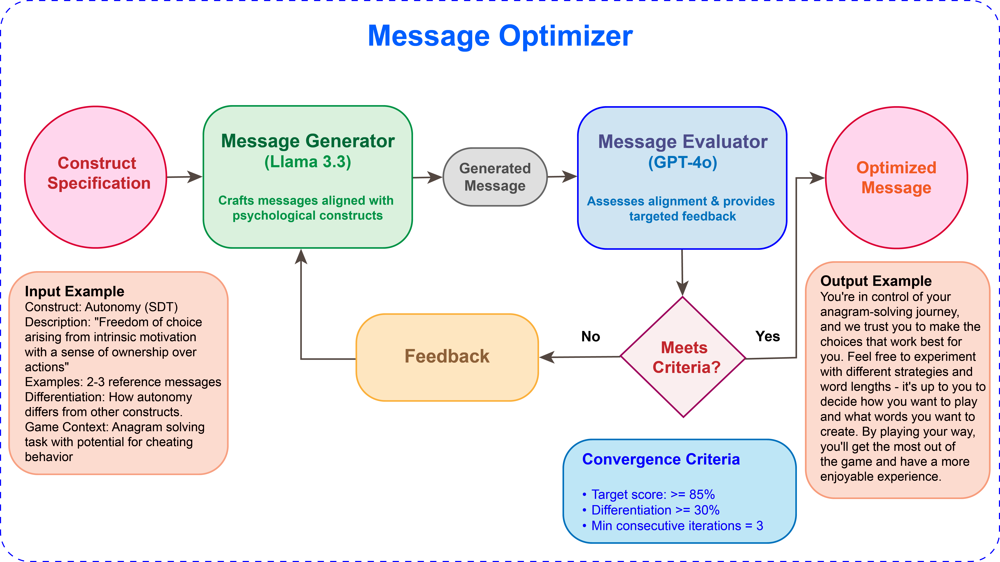

# Message Intervention Framework

This framework optimizes anti-cheating messages for the puzzle solving game application, using a sophisticated agent-based approach to generate messages aligned with various psychological constructs.

## Overview

The Message Intervention Framework is a critical component of the larger game-behavior-intervention-study. It serves to generate, evaluate, and optimize psychologically-aligned messages that aim to reduce cheating behavior in the puzzle solving game. The system leverages advanced language models in a carefully designed workflow to create effective behavioral interventions.

## Getting Started

### Environment Setup

1. Create a new Python virtual environment:

```bash
# Using conda
conda create -n <env_name e.g. game_intervention_behavior>
```

2. Activate the environment:

```bash
# Using conda (all platforms)
conda activate game_intervention_behavior
```

3. Install dependencies:

```bash
pip install -r requirements.txt
```

### API Configuration

Create a `.env` file in the root directory with your API keys:

```
TOGETHER_API_KEY=your_together_ai_key_here
OPENAI_API_KEY=your_openai_key_here
```

These keys are essential for connecting to the respective APIs:

- `TOGETHER_API_KEY`: For accessing Llama 3.3 70B via Together.ai
- `OPENAI_API_KEY`: For accessing GPT-4o via OpenAI

## Application Flow

The framework follows a three-part architecture centered around message optimization:

```
run_optimizer.py (Entry point)
├── optimizer/message_optimizer.py (Coordinates the optimization process)
│   ├── generator/message_generator.py (Generates messages using LlamaGenerator)
│   │   └── common/constants.py (Provides construct definitions and game context)
│   │
│   ├── evaluator/message_evaluator.py (Evaluates messages using GPTEvaluator)
│   │   ├── common/constants.py (Provides construct definitions)
│   │   └── common/utils.py (Provides utility functions for extracting ratings)
│   │
│   └── common/utils.py (Provides visualization and summary functions)
│
└── common/constants.py (Directly accessed for construct information)
```

## Generator-Evaluator Workflow

The framework implements an iterative optimization process using two specialized agents:

1. **Generator Agent (Llama 3.3 70B)**:

   - Crafts initial messages aligned with specific psychological constructs
   - Refines messages based on feedback from the evaluator

2. **Evaluator Agent (GPT-4o)**:

   - Assesses message alignment with the target construct
   - Provides detailed feedback for improvement
   - Quantifies alignment across all constructs to measure differentiation

3. **Optimizer Component**:
   - Coordinates the interaction between generator and evaluator
   - Implements convergence criteria to determine when a message is sufficiently optimized
   - Tracks performance metrics and saves results

The workflow iteratively improves messages until they reach target thresholds for below conditions for at least 3 iterations consecutively:

- Alignment with the target construct (more than 85%)
- Differentiation from competing constructs (more than 30%)

### Workflow Visualization

Here is the visualization of this workflow:

```markdown

```

### Prompt and Feedback Details

The diagram illustrates the high-level workflow, but the actual process involves sophisticated prompting and feedback mechanisms:

**Generator Prompts:**

- Each generation request includes the full psychological construct definition
- Examples of well-aligned messages serve as references
- Specific differentiation guidance explains how the target construct differs from similar constructs
- Detailed context about the anagram game and potential cheating behaviors
- Natural language instructions prioritizing 2-3 sentence motivational messages at ~8th-grade reading level

**Evaluator Analysis:**

- Structured scoring across 5 criteria: core element alignment, differentiation, language appropriateness, conciseness, and context relevance
- Quantitative scores (0-100%) for the target construct and all competing constructs
- Detailed analysis of which aspects of the message align with which constructs
- Identification of specific phrases that might trigger competing construct associations

**Feedback Mechanism:**
The evaluator provides structured feedback including:

1. Specific alignment scores for target and competing constructs
2. Identification of the strongest competing construct
3. Targeted suggestions for improving differentiation
4. Specific language recommendations to strengthen alignment
5. Context refinements to better match the anagram game scenario

This evaluation-optimization cycle continues until convergence criteria are met, typically requiring 8-15 iterations per message.

## Component Descriptions

### Message Generator (`generator/message_generator.py`)

The message generator leverages the Llama 3.3 70B model to:

- Create natural, motivational messages aligned with specific psychological constructs
- Generate multiple variations for each construct
- Refine messages based on evaluation feedback
- Filter out specific terminology that might prime participants

### Message Evaluator (`evaluator/message_evaluator.py`)

The evaluator module uses GPT-4o to:

- Assess how well messages embody target psychological constructs
- Provide detailed alignment scores for all constructs
- Generate structured feedback for message improvement
- Identify which competing constructs are most similar

### Message Optimizer (`optimizer/message_optimizer.py`)

The optimization engine:

- Coordinates the iterative process between generator and evaluator
- Tracks convergence metrics and implements stopping criteria
- Manages the generation parameters based on evaluation feedback
- Creates visualizations and summary statistics for analysis
- Saves optimized messages with their evaluation metrics

## Running the Optimizer

Execute the optimization process using:

```bash
python run_optimizer.py [options]
```

Command-line options:

- `--construct`: Target construct for message optimization (if not specified, optimize all)
- `--num-messages`: Number of messages to optimize per construct (default: 3)
- `--max-iterations`: Maximum iterations per message (default: 20)
- `--min-consecutive`: Minimum consecutive iterations meeting criteria (default: 3)
- `--target-score-threshold`: Target construct score threshold (default: 85.0)
- `--score-difference-threshold`: Required difference from competing constructs (default: 30.0)
- `--output`: Output directory for results (default: optimization_results)
- `--generator-temp`: Temperature for message generator (default: 0.7)
- `--evaluator-temp`: Temperature for message evaluator (default: 0.3)

## Psychological Constructs

The framework is designed to generate messages aligned with multiple psychological theories:

- **Self-Determination Theory (SDT)**

  - Autonomy, Competence, Relatedness

- **Cognitive Dissonance Theory (CDT)**

  - Self-concept, Cognitive inconsistency, Dissonance arousal, Dissonance reduction

- **Self-Efficacy Theory (SET)**

  - Performance accomplishments, Vicarious experience, Efficacy expectations, Emotional arousal

- **Social Norm Theory (SNT)**
  - Descriptive Norms, Injunctive Norms, Social Sanctions, Reference Group Identification

## Output

The optimizer will generate several outputs in newly created optimization_results folder:

- JSON files of optimized messages with evaluation metrics
- Convergence plots showing the optimization process
- Summary statistics across all optimization runs
